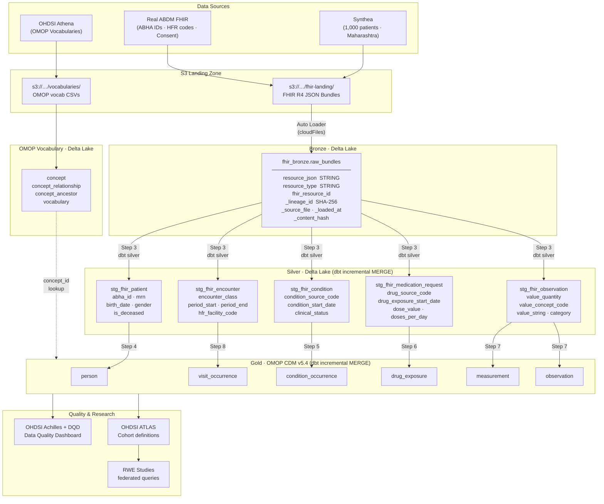
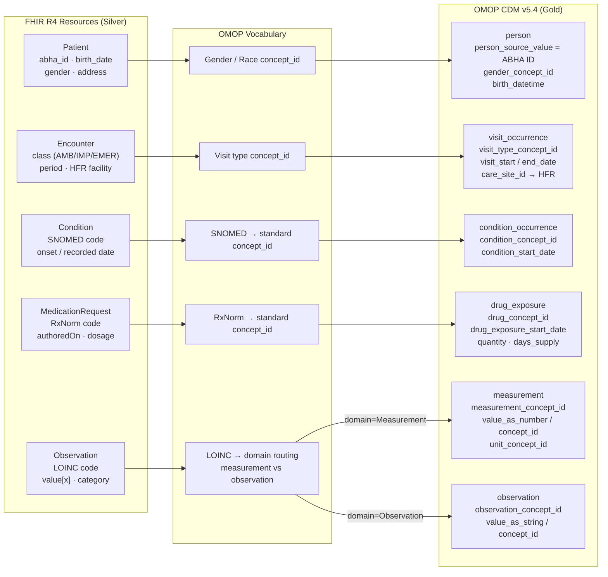

# Architecture & Project Plan

## Architecture



---

## FHIR → OMOP Mapping



---

## Project Plan

### Phase 1 — Foundations `Steps 1–3`

| Step | Notebook | What it builds | Status |
|------|----------|----------------|--------|
| 1 | `01_synthea_setup.py` | Generate 1,000 synthetic patients (Maharashtra) | ✅ Done |
| 2 | `02_bronze_ingestion.py` | Auto Loader → `fhir_bronze.raw_bundles` (Delta, append-only) | ✅ Done |
| 3 | `03_silver_flattening.py` | Bronze → 5 Silver tables (dbt MERGE on `_lineage_id`) | ✅ Done |

---

### Phase 2 — FHIR → OMOP Mapping `Steps 4–10`

| Step | Notebook | FHIR → OMOP | Key challenge |
|------|----------|-------------|---------------|
| 4 | `04_omop_patient.py` | Patient → `person` | gender/race `concept_id` lookup; ABHA ID as `person_source_value` |
| 5 | `05_omop_condition.py` | Condition → `condition_occurrence` | SNOMED → standard concept; source vs standard concept split |
| 6 | `06_omop_medication.py` | MedicationRequest → `drug_exposure` | RxNorm normalization; `days_supply` derivation |
| 7 | `07_omop_observation.py` | Observation → `measurement` / `observation` | LOINC domain routing; unit concept_id lookup |
| 8 | `08_omop_encounter.py` | Encounter → `visit_occurrence` | visit type concept_id; care_site from HFR code |
| 9 | `09_vocabulary_setup.py` | Load OMOP vocab tables | Athena download; Delta Lake vocab tables |
| 10 | `10_achilles_dqd.py` | Run Achilles + DQD | Automated data quality checks against OMOP CDM |

---

### Phase 3 — India / ABDM Layer `Steps 11–15`

| Step | Notebook | Focus |
|------|----------|-------|
| 11 | `11_abdm_gap_analysis.py` | Diff ABDM FHIR IG v6.5 vs Synthea output; identify missing extensions |
| 12 | `12_abdm_patient_mapping.py` | ABHA ID deduplication; ABDM Consent resource → OMOP observation |
| 13 | *(planned)* | Indian drug dictionary mapping (CDSCO codes → RxNorm/ATC) |
| 14 | *(planned)* | HFR facility registry → OMOP `care_site` table |
| 15 | *(planned)* | ICD-10-CM India variant handling; SNOMED India extension |

---

### Phase 4 — RWD Research Layer `Steps 16–19`

| Step | Focus |
|------|-------|
| 16 | Cohort definitions in ATLAS (diabetes, hypertension, oncology) |
| 17 | Federated OMOP query across multiple hospital sites |
| 18 | RWE study setup: treatment pathways, incidence rates |
| 19 | Export to OHDSI network study format |

---

## Key Design Decisions

| Decision | Choice | Rationale |
|----------|--------|-----------|
| Bronze dedup | None (append-only) | Auto Loader guarantees file-level exactly-once; dedup at Silver |
| Silver merge key | `_lineage_id` = SHA-256(file + resource ID) | Deterministic across re-runs; stable for cross-layer joins |
| FHIR bundle parsing | Python UDF (json.loads) | `from_json` with `resource:string` silently returns nulls — object ≠ string |
| Observation routing | Preserve all `value[x]` in Silver | Gold routes to `measurement` vs `observation` via OMOP domain lookup |
| ABHA ID extraction | `get(filter(...), 0)` not `[0]` | `[0]` throws on empty array; `get()` returns NULL safely |
| ABDM identifiers | `person_source_value` = ABHA ID | Enables patient matching across hospital systems |

---

## Testing Strategy

```
Unit tests (local PySpark, no cluster)   ← pytest tests/ -v
├── test_patient_mapping.py              Patient field extraction + ABHA fallback
├── test_condition_mapping.py            SNOMED extraction + onset date fallback
├── test_medication_mapping.py           RxNorm extraction + dosage parsing
└── test_abdm_extensions.py             ABHA format · HFR codes · Consent profile

Integration tests (Databricks cluster)  ← dbt test
├── assert_person_no_nulls.sql
├── assert_condition_valid_concepts.sql
└── assert_drug_exposure_dates.sql

Data quality (post-load)                ← OHDSI Achilles + DQD
└── Automated CDM conformance checks
```
